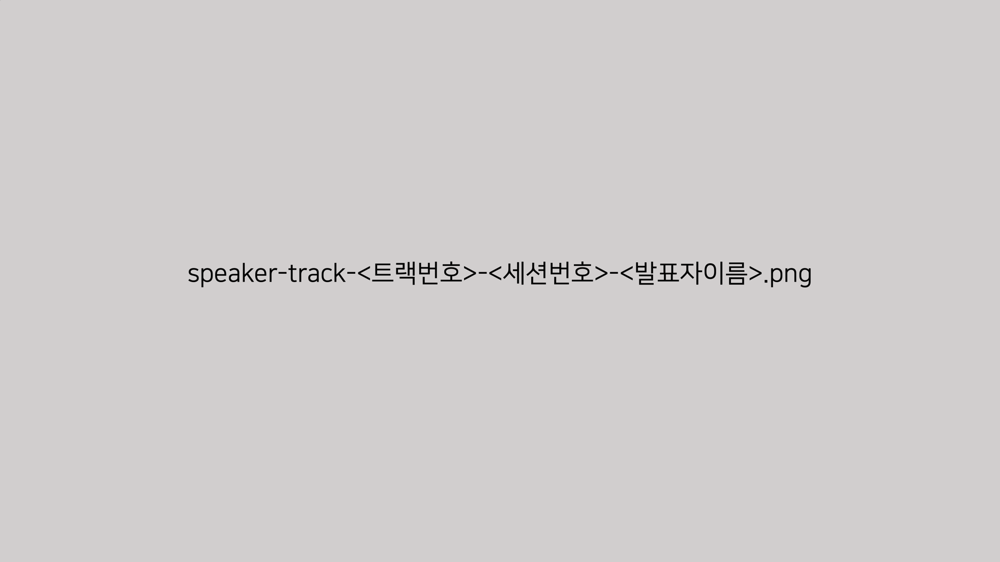

# 동영상 편집 가이드라인 #

## 편집 전 절차 ##

1. 발표자로부터 게시 승인을 받는다.
   * 조건부 승인일 경우 해당 조건을 갖춘 후에 최종 확인 후 게시해야 한다.

## 편집 가이드라인 ##

* 동영상 맨 처음은 페이드-인 처리
* 동영상 맨 마지막은 페이드-아웃 처리
* 나머지 부분에서는 편집자 재량

### 본 동영상 이전 ###

#### 발표내용에 스폰서 관련 언급이 **있을** 경우 ####

샘플 동영상: [gav2020kr-d3-preview-sponsors.mp4](gav2020kr-d3-preview-sponsors.mp4)

본 동영상 이전에 아래 두 슬라이드를 순서대로 배치한다.

  
  

#### 발표내용에 스폰서 관련 언급이 **없을** 경우 ####

샘플 동영상: [gav2020kr-d3-preview-nosopnsors.mp4](gav2020kr-d3-preview-nosopnsors.mp4)

본 동영상 이전에 아래 세 슬라이드를 순서대로 배치한다.

  
  
  

### 본 동영상 ###

> **아주 중요합니다!!**
> 
> **발표자의 개인 정보 부분이 있는지 확인하고, 있을 경우 반드시 모자이크 처리한다.**

### 본 동영상 이후 ###

본 동영상 이후 아래 두 슬라이드를 순서대로 배치한다.

  
  
